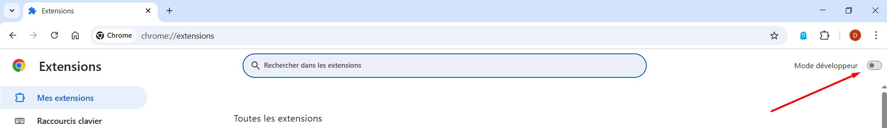
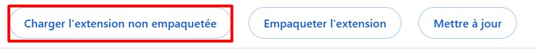
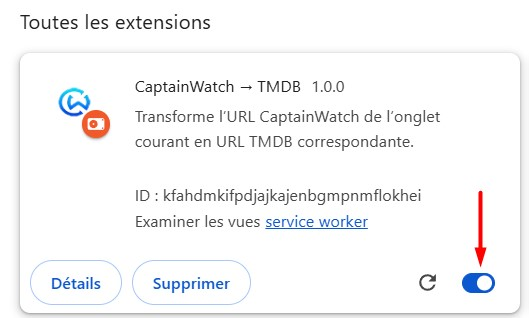
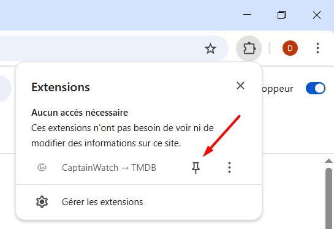
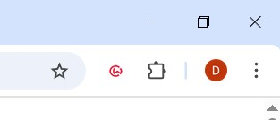
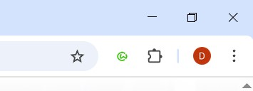

# Extension Chrome : CaptainWatch → TMDB

## Objectif

Créer une extension pour navigateurs basés sur Chromium (Chrome, Edge, Brave, etc.) qui permet, lorsqu’on visite une page CaptainWatch, de générer et d’ouvrir l’URL correspondante sur The Movie Database (TMDB).

## Fonctionnalités principales

- L’extension est active uniquement si l’onglet courant correspond à une URL CaptainWatch.
- Un bouton d’action (icône dans la barre d’outils) permet de transformer l’URL CaptainWatch en URL TMDB et d’ouvrir cette dernière dans un nouvel onglet.
- L’icône change dynamiquement : verte si l’extension est utilisable, rouge sinon (icônes dans le dossier `icons`).
- Extraction automatique du type de contenu ("serie", "film", "artiste") et de l’identifiant numérique depuis l’URL CaptainWatch.
- Génération de l’URL TMDB correspondante :
  - `serie` → `tv`
  - `film` → `movie`
  - `artiste` → `person`
- Ouverture de l’URL TMDB dans un nouvel onglet.
- Structure modulaire : la logique métier est centralisée dans `utils.js` et utilisée dans `background.js`.
- Tests unitaires avec Jest sur la logique métier (`utils.test.js`).
- Fichier `.gitignore` pour la publication propre du projet.
- La popup est définitivement abandonnée.

## Exemple

- CaptainWatch : `https://www.captainwatch.com/serie/93405/squid-game`
- TMDB : `https://www.themoviedb.org/tv/93405`
- CaptainWatch : `https://www.captainwatch.com/film/27205/inception`
- TMDB : `https://www.themoviedb.org/movie/27205`
- CaptainWatch : `https://www.captainwatch.com/artiste/138/quentin-tarantino`
- TMDB : `https://www.themoviedb.org/person/138`

## Technologies utilisées

- Manifest V3 (standard Chrome Extensions)
- JavaScript (ES6+)
- Icônes verte et rouge pour l’état actif/inactif (dossier `icons`)
- Jest pour les tests unitaires

## Structure du projet

- `manifest.json` : Déclaration de l’extension
- `background.js` : Gestion de l’activation, de l’action du bouton et du changement d’icône
- `utils.js` : Fonctions métier (extraction, mapping, génération d’URL)
- `test/` : Dossier des tests unitaires Jest (ex : utils.test.js)
- `icons/` : Icônes verte et rouge (ex : icon48-green.png, icon48-red.png)
- `.gitignore` : Fichiers à exclure du dépôt
- `README.md` : Documentation et instructions

## TODO – Étapes de développement

- [x] Initialiser le projet et créer le manifest.json
- [x] Détecter l’URL CaptainWatch et activer le bouton uniquement sur les pages valides
- [x] Extraire le type de contenu et l’identifiant depuis l’URL
- [x] Générer l’URL TMDB correspondante (mapping type)
- [x] Ouvrir la nouvelle URL TMDB dans un onglet
- [x] Gérer le changement d’icône (verte/rouge) selon l’état (dossier `icons`)
- [x] Centraliser la logique métier dans `utils.js` et l’utiliser dans `background.js`
- [x] Ajouter des tests unitaires avec Jest (`utils.test.js`)
- [x] Ajouter un fichier `.gitignore` pour la publication
- [x] Tester le fonctionnement sur différents cas d’URL
- [x] Finaliser et maintenir la documentation (README)
- [x] Adapter les icônes si besoin (tailles, couleurs)
- [x] Nettoyer le projet

## Instructions d’installation

### Installation au format `.zip` (mode développeur)

1. Récupérez le fichier `.zip` fourni par le développeur.
2. Décompressez-le dans un dossier.
3. Ouvrez la page des extensions de votre navigateur :
   - **Chrome** : `chrome://extensions/`
   - **Brave** : `brave://extensions/`
   - **Opera** : `opera://extensions/`
   - **Edge** : `edge://extensions/`
   - Autres navigateurs Chromium : cherchez « extensions » dans la barre d’adresse.
4. Activez le « Mode développeur » (généralement en haut à droite).
   
5. Cliquez sur « Charger l’extension non empaquetée » et sélectionnez le dossier décompressé.
   
6. L’extension devrait apparaître dans la liste avec son icône. Assurez-vous qu’elle est activée.
   
7. Épinglez l’icône de l’extension dans la barre d’outils pour un accès rapide.
   
8. Profitez de l’extension ! En dehors des pages CaptainWatch, l’icône sera rouge et inactive.
   
9. Sur une page valide, elle deviendra verte et cliquable.

   
